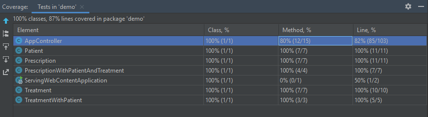

# IS-Project-2022(Mentcare System)
Progetto sviluppato da:

* Riccardo Bologna VR474721

* Luigi Hu VR474722
##Introduzione
Il progetto implementa un software di gestione di informazioni dei pazienti 
nell'ambito "Mental health care".

Si è deciso di sviluppare la componente del software utilizzata dall'utente "medico", 
tramite la quale potrà gestire le prescrizioni che fornirà ai pazienti a fine trattamento.
Si assume che le liste dei pazienti e trattamenti siano già presenti nel sistema 
in quanto gestite da altri componenti(clinica/reception). 

Il trattamento viene inteso come visita dal medico durante la quale si svolge una determinata terapia, mentre
la prescrizione viene intesa come ricetta contenente medicinali/consigli 
fornita al paziente a fine trattamento.

##Requisiti

Il sistema deve essere in grado di identificare il medico per permettergli di usare le funzionalità implementate.

Una volta verificata l'identità, il medico, tramite il sistema,
tiene traccia delle informazioni dei suoi pazienti, i relativi
trattamenti e prescrizioni mediche.

-Il medico può visualizzare la lista di tutti i suoi pazienti e, per ciascuno di essi, 
i relativi dati personali con lo storico delle loro prescrizioni.

-Il medico può visualizzare sia la lista di tutti i trattamenti(passati e futuri) 
che quella dei trattamenti previsti in giornata.

-Il medico può creare delle prescrizioni riguardanti un determinato trattamento.

-Il medico può visualizzare la lista di tutte le prescrizioni emesse 
e, per ciascuna di esse, può modificarla/eliminarla a seconda delle sue esigenze.

##Scenari

1. <ins>Log-in nel sistema</ins>:
Il medico per poter accedere al sistema deve inserire 
le proprio credenziali(fornite in precedenza). Se le credenziali sono **corrette**, 
il medico può iniziare ad utilizzare il sistema.
Se le credenziali sono **sbagliate**, il sistema richiede di inserire nuovamente le credenziali.

2. <ins>Visualizza informazioni dei pazienti</ins>: Dopo aver effettuato l'accesso, 
il medico può schiacciare il bottone "*Patients*" per visualizzare la lista di tutti i suoi pazienti. 
Inoltre può visualizzare in dettaglio le informazioni di un determinato paziente e le relative prescrizioni
cliccando il link "*Show infos*" presente accanto ad ogni paziente. 
Sono presenti anche dei bottoni che permettono la navigazione tra le pagine sopracitate.

3. <ins>Visualizza lista dei trattamenti</ins>: Dopo aver effettuato l'accesso,
   il medico può schiacciare il bottone "*Treatments*" per visualizzare la lista di tutti i trattamenti. 
Inoltre può visualizzare la lista dei trattamenti giornalieri tramite il bottone "*Show today's treatments*".
   Sono presenti anche qui dei bottoni che permettono la navigazione tra le pagine sopracitate.

4. <ins>Visualizza lista delle prescrizioni</ins>: Dopo aver effettuato l'accesso,
   il medico può schiacciare il bottone "*Prescriptions*" per visualizzare la lista di tutte le prescrizioni.
   Sono presenti anche qui dei bottoni che permettono la navigazione tra le pagine sopracitate.

5. <ins>Creazione prescrizione</ins>: Durante la visualizzazione della lista dei trattamenti(totali o giornalieri)
il medico può creare una prescrizione cliccando al link "*New prescription*" presente accanto ad ogni trattamento.
Una volta cliccato il link, il medico deve inserire i dati della prescrizione (medicinali/suggerimenti)
e confermare la creazione tramite il bottone "*Send Request*". 
Sono presenti anche qui dei bottoni che permettono la navigazione tra le pagine sopracitate.

   
6. <ins>Modifica prescrizione</ins>: Durante la visualizzazione della lista delle prescrizioni il medico 
può modificarne una cliccando al link "*Edit*" presente accanto a ciascuna di esse.
   Una volta cliccato il link, il medico può modificare i dati della prescrizione
   e confermare la modifica tramite il bottone "*Send Request*".
   Sono presenti anche qui dei bottoni che permettono la navigazione tra le pagine sopracitate.

7. <ins>Elimina prescrizione</ins>: Durante la visualizzazione della lista delle prescrizioni il medico
   può eliminarne una cliccando al link "*Delete*" presente accanto a ciascuna di esse.
   Una volta cliccato il link, la prescrizione viene rimossa.

##Test

I test sono stati implementati usando il metodo dei PageObject per facilitarne la comprensione.
Sono stati implementati casi di test per ogni scenario per verificare che tutte le funzionalità sviluppate 
funzionino correttamente.

I casi di test da noi implementati sono:

1.<ins>Log-in nel sistema</ins>:
* "*TestValidLogin*": Si è testato un accesso valido al sistema tramite l'inserimento 
di credenziali corrette (Username: admin, Password: admin). 
* "*TestInvalidLogin*": Si è testato un accesso invalido al sistema tramite l'inserimento
  di credenziali errate seguito da un accesso valido con inserimento di credenziali corrette. 

2.<ins>Visualizza informazioni dei pazienti</ins>: 
* "*TestHomePatientsButton*": Dopo aver effettuato il log-in, si è testato il corretto indirizzamento alla lista
dei pazienti.
* "*TestShowInfoPatients*": Oltre alle verifiche del precedente test, si è testata la corretta 
visualizzazione della lista dei pazienti. Inoltre si è verificata la corretta visualizzazione 
dei dati del primo paziente.

3.<ins>Visualizza lista dei trattamenti</ins>:
* "*TestHomeTreatmentsButton*": Dopo aver effettuato il log-in, si è testato il corretto indirizzamento alla lista
  dei trattamenti.
* "*TestShowTreatments*": Oltre alle verifiche del precedente test, si è testata la corretta
  visualizzazione della lista completa dei trattamenti.
* "*TestShowDailyTreatments*": Oltre alle verifiche effettuate nel precedente test, si è testato il corretto
indirizzamento e visualizzazione della lista dei trattamenti previsti in giornata.

4.<ins>Visualizza lista delle prescrizioni</ins>:
* "*TestHomePrescritionsButton*": Dopo aver effettuato il log-in, si è testato il corretto indirizzamento alla lista
   delle prescrizioni.

5.<ins>Creazione prescrizione</ins>:
* "*TestCreatePrescriptionsByTreatmentsList*": Dopo aver verificato la visualizzazione della lista completa 
dei trattamenti, si è testata la corretta creazione di una prescrizione relativa al primo trattamento della lista.
* "*TestCreatePrescriptionsByDailyTreatmentsList*": Dopo aver verificato la visualizzazione della lista dei trattamenti
previsti in giornata, si è testata la corretta creazione di una prescrizione relativa al primo trattamento della lista.

6.<ins>Modifica prescrizione</ins>:
* "*TestEditPrescription*": Dopo aver verificato la corretta visualizzazione della lista delle prescrizioni, 
si è testata una modifica alla prima di esse.

7.<ins>Elimina prescrizione</ins>:
* "*TestDeletePrescription*":  Dopo aver verificato la corretta visualizzazione della lista delle prescrizioni,
  si è testata la corretta eliminazione del primo record.

In tutti i casi di test si è verificata la corretta navigazione tra le pagine tramite l'uso dei bottoni/link.

Tutti i test passano con successo se eseguiti singolarmente. Al contrario, se eseguiti tutti insieme in blocco,
alcuni test falliscono in quanto, modificando la repository, creano inconsistenze con gli altri. 

Il test coverage risulta essere:

Il coverage testing dei metodi dell'AppController risulta essere dell'80% a causa del problema sopra citato.

